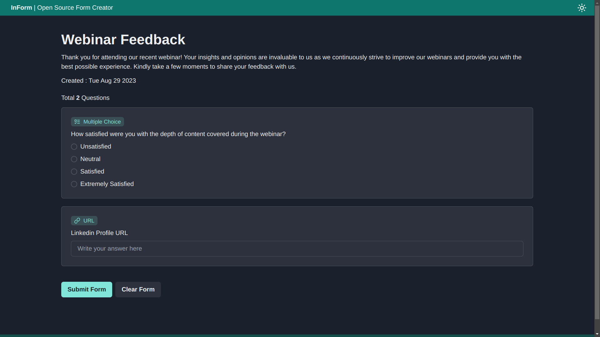
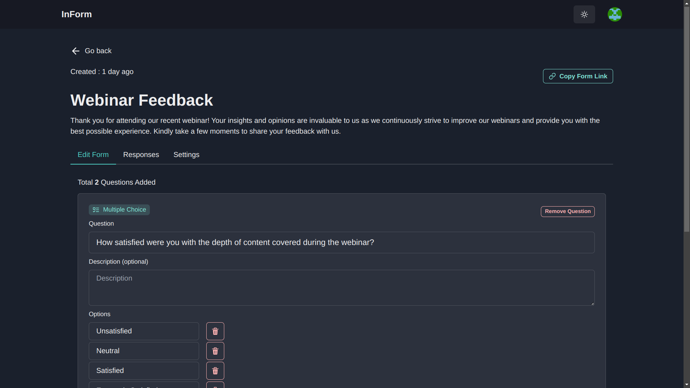
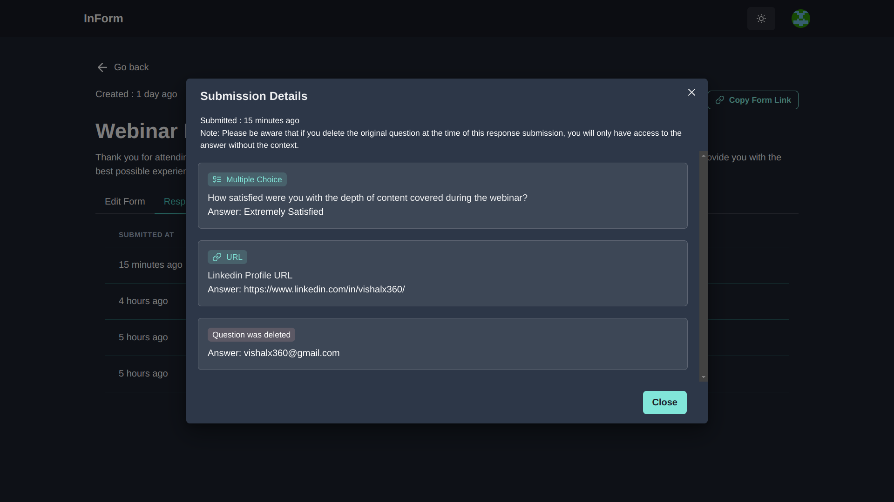
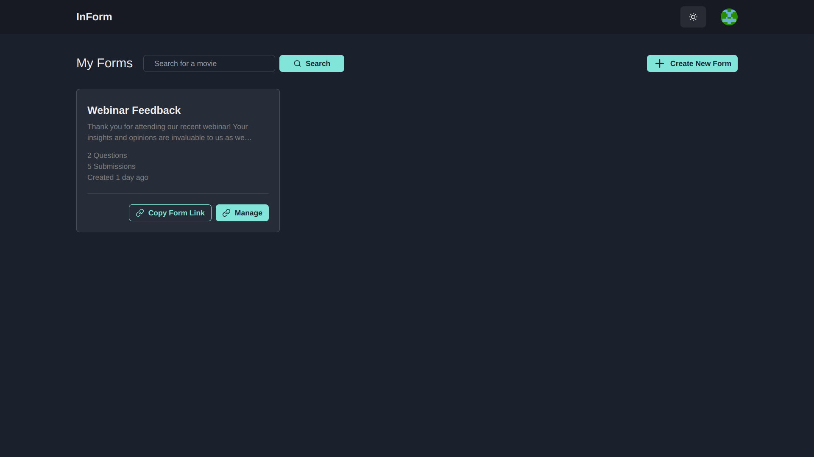
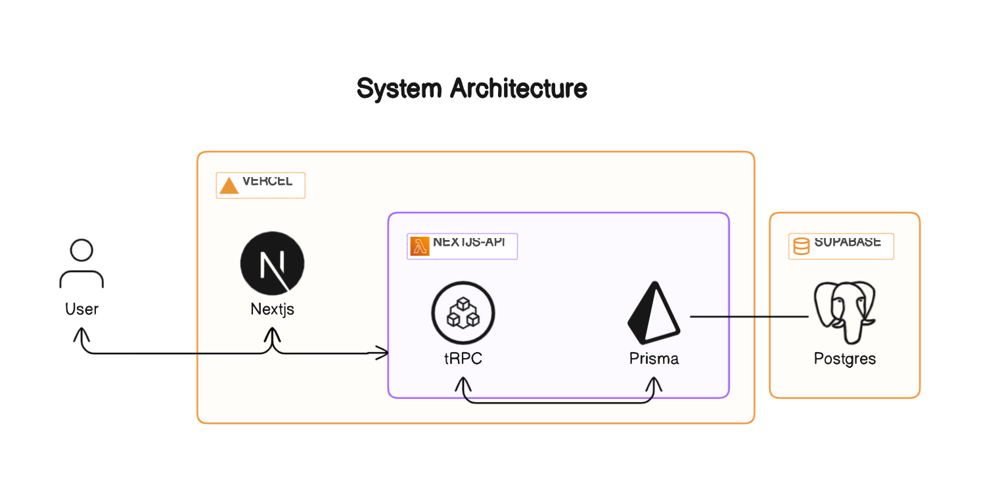
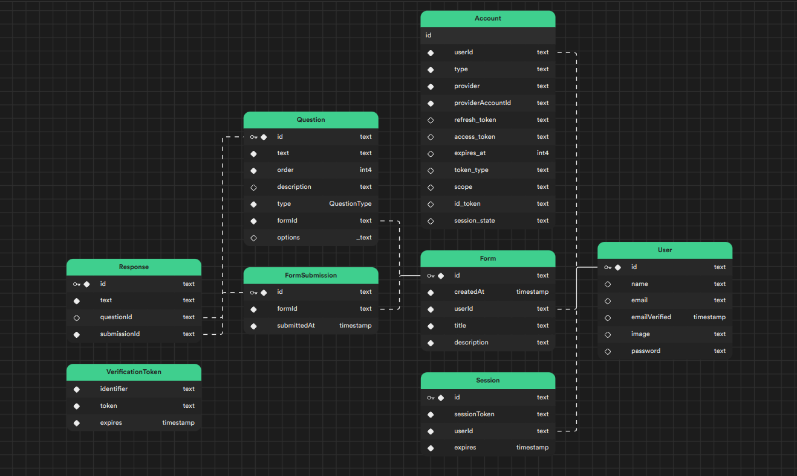
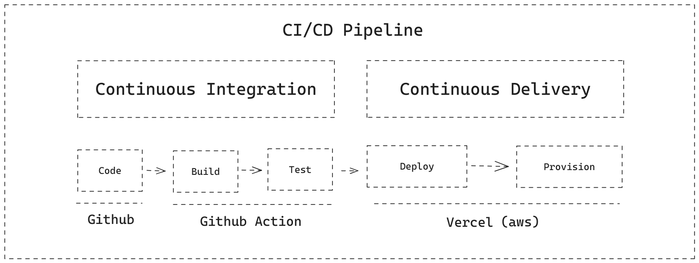

# InForm

**Live Demo:** [In-form Web Application](https://in-form.vercel.app)

## Overview
InForm is an intuitive web application designed to facilitate seamless form creation and survey management. Users can design custom forms, share them effortlessly, and track responses with ease.

## Getting Started
To set up the application locally, follow the [Setup Instructions](/Setup-Instruction.md).

## Key Features

**Customizable Form Creation:** Users can design personalized forms tailored to their specific needs with ease.

**Effortless Form Sharing:** Forms can be easily shared via links, enabling broad accessibility and data collection.

**Response Management:** Users can conveniently track, review, and analyze submitted responses within the platform.

**Post-Creation Editing:** Modify and refine forms even after they have been published, ensuring they remain relevant and effective.

**Diverse Question Types with Robust Validation:** Supports multiple question formats, each equipped with precise validation for enhanced user experience:
   - **Multiple Choice Questions**
   - **Text-Based Inputs**
   - **Email Address Fields**
   - **URL Inputs**

## Screenshots

|                  Form Fill-Up Page                  |                 Form Editor Page                  |
| :-----------------------------------------------: | :-----------------------------------------------: |
|  |  |

|               Form Submissions Page               |                Dashboard Page                 |
| :-----------------------------------------------: | :-------------------------------------------: |
|  |  |

## Tech Stack

### Highlights

**Front-End with Next.js:** Built using Next.js, a powerful framework that ensures optimal performance and smooth user interactions.

**Backend with Serverless Functions:** Next.js serverless functions handle API requests efficiently, offering a scalable and robust backend solution.

**Database Management:** Uses Supabase Serverless Postgres DB for reliable data storage and retrieval.

**CI/CD Integration:** Automated build, test, and deployment processes are powered by GitHub Actions, ensuring continuous integration and delivery.

| Technology                                            | Description                                                                                         |
| ----------------------------------------------------- | --------------------------------------------------------------------------------------------------- |
| [Next.js](https://nextjs.org)                         | React framework for developing high-performance web applications.                                   |
| [tRPC](https://trpc.io/)                              | TypeScript-based RPC framework for API development.                                                |
| [Supabase DB](https://supabase.com)                   | Serverless Postgres database for scalable data management.                                         |
| [Prisma](https://www.prisma.io)                       | Type-safe ORM for efficient database interaction.                                                  |
| [NextAuth](https://next-auth.js.org)                  | Authentication solution tailored for Next.js applications.                                         |
| [Tailwind CSS](https://tailwindcss.com/)              | Utility-first CSS framework for rapid UI development.                                             |
| [Chakra UI](https://chakra-ui.com/)                   | Modern React component library for flexible UI design.                                            |
| [Vercel](https://vercel.com)                          | Cloud-based deployment platform for seamless application hosting.                                 |
| [GitHub Actions](https://github.com/features/actions) | CI/CD automation tool for streamlining the build and deployment pipeline.                         |

## System Architecture (HLD)

## Database Schema

## CI/CD Pipeline

