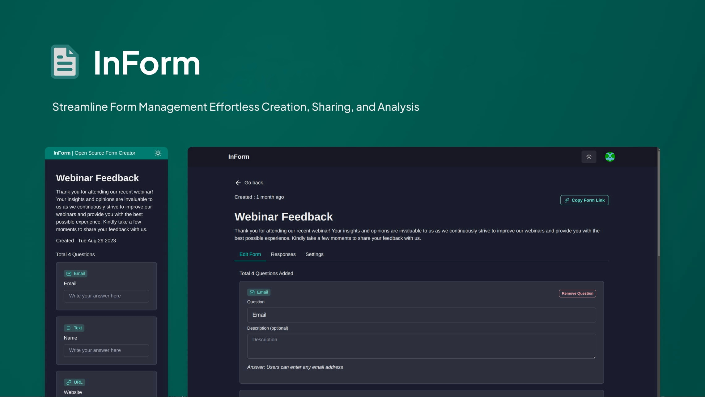

# InForm

Demo: [https://inform-app.vercel.app](https://in-form.vercel.app)

A web application that allows users to create forms and take surveys.

## Getting Started

Want to set up locally? follow [Setup Instructions](/Setup-Instruction.md)

## Application Features

1. **Form Creation Flexibility:**
   Empower users to craft tailored forms effortlessly, adapting to their unique requirements.

2. **Seamless Sharing Capability:**
   Enable users to effortlessly share form links with a wide audience, fostering collaboration and data gathering.

3. **Submission Tracking and Review:**
   Provide users with the means to conveniently access and assess submitted form responses, streamlining data analysis.

4. **Dynamic Post-Creation Editing:**
   Offer the flexibility to fine-tune forms even after their initial creation, ensuring the ongoing relevance and effectiveness of each form.

5. **Versatile Question Types with Precision Validation:**
   Equip users with a range of question types, each fortified with meticulous validation:

   - **Multiple Choice Queries**

   - **Text Inquiries**

   - **Email Address Queries**

   - **URL Input Queries**
